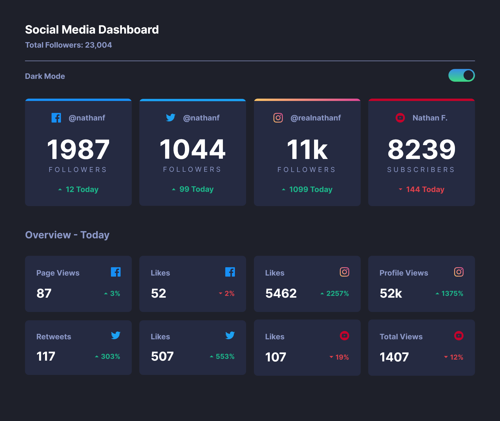
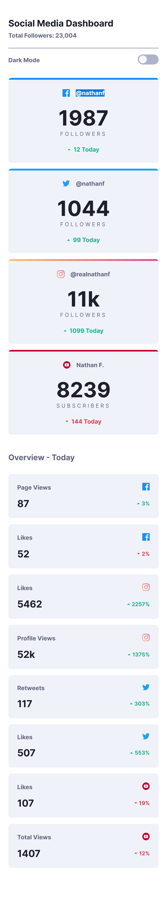

# Frontend Mentor - Social media dashboard with theme switcher solution

This is a solution to the [Social media dashboard with theme switcher challenge on Frontend Mentor](https://www.frontendmentor.io/challenges/social-media-dashboard-with-theme-switcher-6oY8ozp_H). Frontend Mentor challenges help you improve your coding skills by building realistic projects.

## Table of contents

- [Overview](#overview)
  - [The challenge](#the-challenge)
  - [Screenshot](#screenshot)
  - [Links](#links)
- [My process](#my-process)
  - [Built with](#built-with)
  - [What I learned](#what-i-learned)
  - [Continued development](Continued-development)
- [Author](#author)

## Overview

### The challenge

Users should be able to:

- View the optimal layout for the site depending on their device's screen size
- See hover states for all interactive elements on the page
- Toggle color theme to their preference

### Screenshot





### Links

- Solution URL: [https://github.com/MIBENIN/Social-media-dashboard-with-theme-switcher](https://github.com/MIBENIN/Social-media-dashboard-with-theme-switcher)
- Live Site URL: [https://mibenin.github.io/Social-media-dashboard-with-theme-switcher/](https://mibenin.github.io/Social-media-dashboard-with-theme-switcher/)

## My process

### Built with

- Semantic HTML5 markup
- CSS custom properties
- Flexbox
- CSS Grid
- Mobile-first workflow

### What I learned

I learned about using dark mode in project using CSS classes..

```html
<div class="dark-mode-toggle-div">
  <input type="checkbox" id="check" />
  <label for="check" class="checkbox-label"></label>
</div>
```

```css
.dark-mode {
  --BG: hsl(230, 17%, 14%);
  --Top-BG-Pattern: hsl(232, 19%, 15%);
  --Card-BG: hsl(228, 28%, 20%);
  --TextColor1: hsl(228, 34%, 66%);
  --TextColor2: hsl(0, 0%, 100%);
  --Toggle: linear-gradient(hsl(210, 78%, 56%), hsl(146, 68%, 55%));
}
```

```js
document.addEventListener("DOMContentLoaded", function () {
  const toggle_btn = document.getElementById("check");
  const isDarkMode = localStorage.getItem("darkMode");

  if (isDarkMode === "true") {
    toggle_btn.checked = true;
    document.body.classList.add("dark-mode");
  }

  toggle_btn.addEventListener("change", () => {
    if (toggle_btn.checked) {
      document.body.classList.add("dark-mode");
      localStorage.setItem("darkMode", "true");
    } else {
      document.body.classList.remove("dark-mode");
      localStorage.setItem("darkMode", "false");
    }
  });
});
```

### Continued development

I implemeneted only manual toggling and saved theme in local storage.I have to make use of system preferences also..Hope i can learn it to.

## Author

- Frontend Mentor - [@MIBENIN](https://www.frontendmentor.io/profile/MIBENIN)
